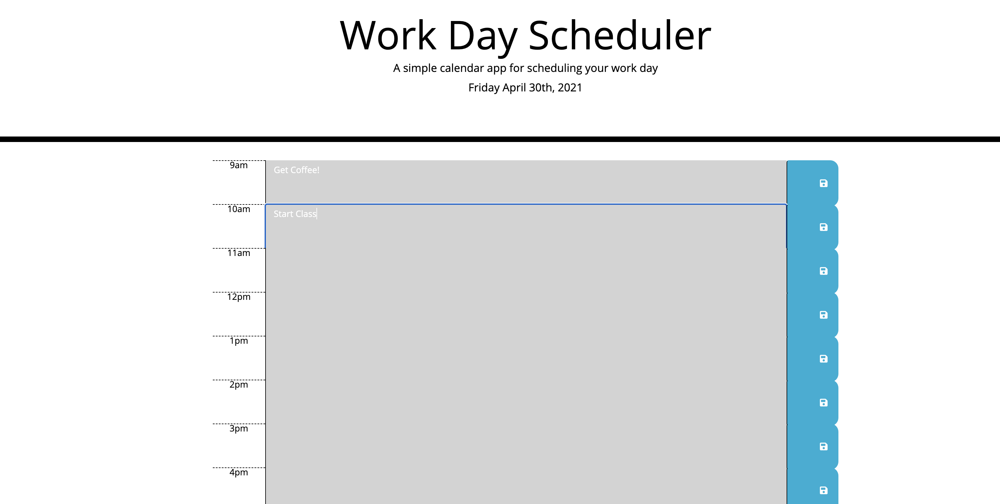
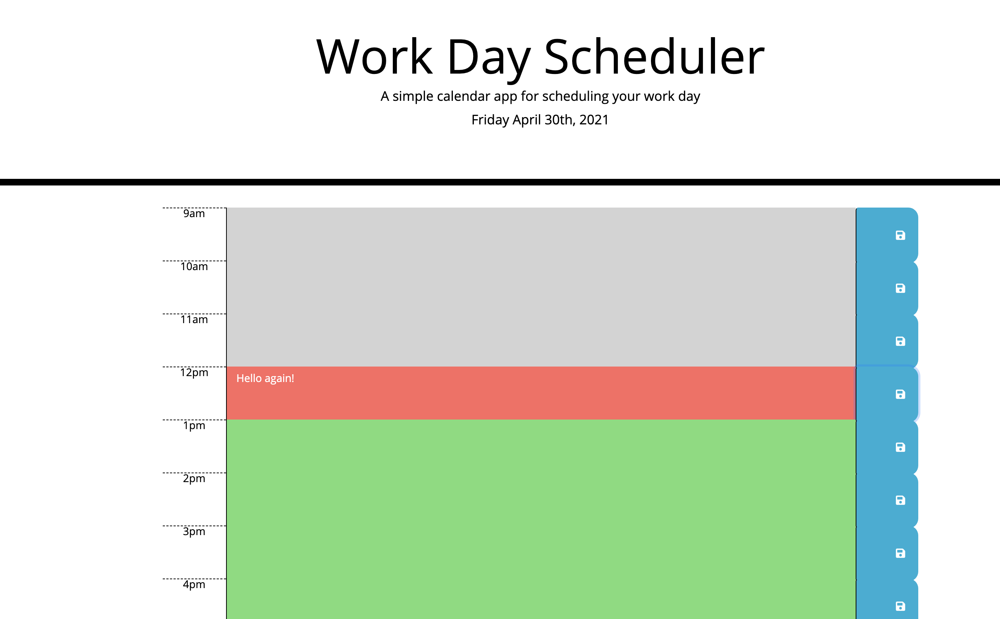

# Word-Day-Scheduler - JS Application

This application creates a daily calendar that the user can utilize to create a daily task list.
The application higlights each hour for the workday (9am to 5pm) color-coding the background to show the current hour, the past hours,
and the future hours.

The user can enter a task in each of the hour sections and the task will be saved to the computer. When the user exits the application,
all tasks will remain and show up when the user accesses the application once again.

## Following are some snap-shots of the application:

## Following is a link to the application

https://forbegos.github.io/Word-Day-Scheduler/
